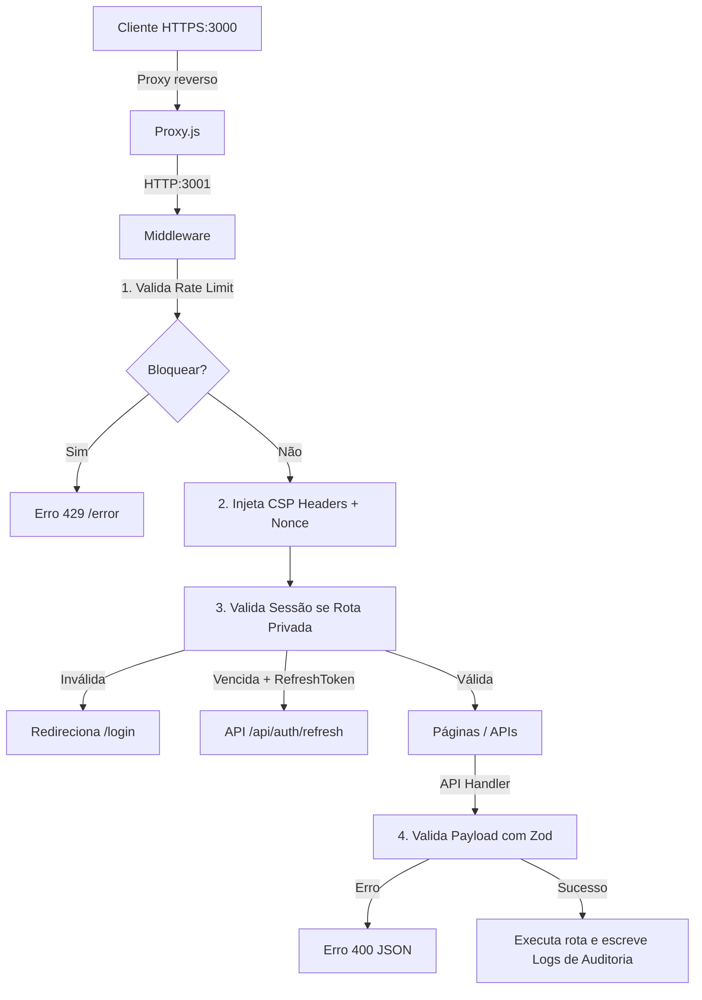

# Arquitetura do Projeto

Este template foi projetado com foco em alta modularidade, segurança máxima e independência de infraestrutura inicial.

## Estrutura de Diretórios

```
├── certs/                      # Chaves e certificados SSL locais para HTTPS
├── docs/                       # Documentação técnica detalhada (sem comentários no código)
├── drizzle/                    # Arquivos de migração SQL gerados pelo Drizzle Kit
├── scripts/                    # Scripts utilitários de automação e setup
├── tests/                      # Suíte de testes locais de segurança
├── proxy.js                    # Servidor Proxy reverso local HTTP -> HTTPS (porta 3000)
├── next.config.ts              # Configurações globais do Next.js
├── tailwind.config.ts          # Configurações do Tailwind CSS
└── src/
    ├── app/                    # Rotas do Next.js (App Router)
    │   ├── api/                # Endpoints de API restritos
    │   ├── (auth)/             # Páginas de Login e Registro
    │   ├── dashboard/          # Painel de controle privado
    │   └── error/              # Página de erro HTTP dinâmica
    ├── components/             # Componentes de interface (Shadcn UI)
    │   ├── auth/               # Formulários de autenticação
    │   ├── charts/             # Gráficos SVG interativos
    │   ├── chat/               # Chat interativo do dashboard
    │   └── ui/                 # Componentes atômicos do Shadcn
    └── lib/                    # Bibliotecas e utilitários
        ├── api/                # Wrapper centralizado de Handlers (defineHandler)
        ├── auth/               # Mecanismo de sessão e cookies seguros
        ├── cache/              # Utilitários de Cache-Control HTTP
        ├── db/                 # Conexões SQL (Drizzle) e NoSQL (MongoDB)
        ├── email/              # Envio de e-mail e presets (Hostinger)
        ├── logger/             # Logging estruturado (JSON/Console)
        ├── rate-limit/         # Rate limiter in-memory com failover para Redis
        ├── schemas/            # Schemas de banco de dados e validações Zod
        ├── security/           # Criptografia AES-256 e assinaturas HMAC
        ├── services/           # Conectores de terceiros (Redis, S3, Stripe, Twilio)
        ├── utils/              # Formatadores e utilitários globais
        └── validation/         # Validador de variáveis de ambiente (.env)
```

## Fluxo de uma Requisição Segura


